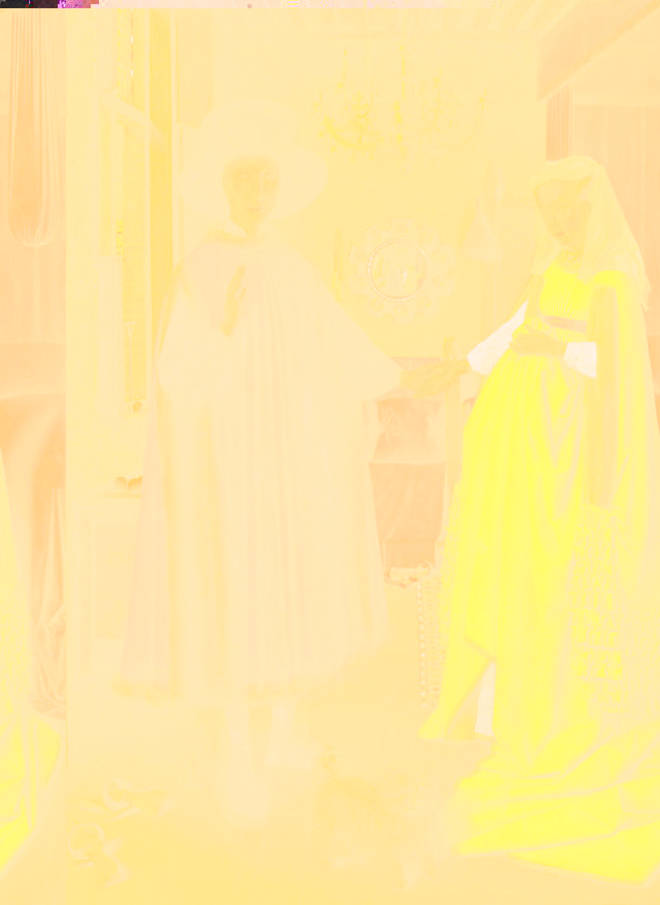
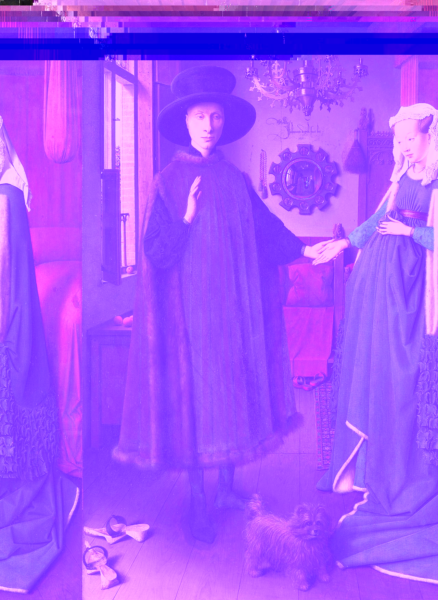
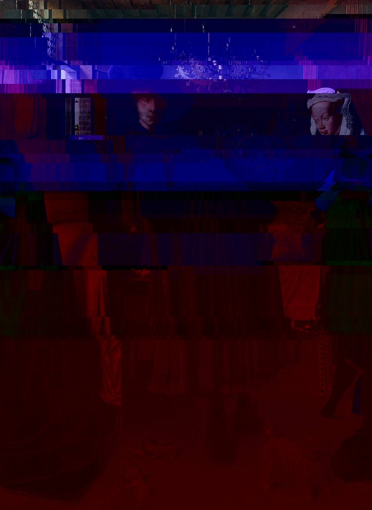
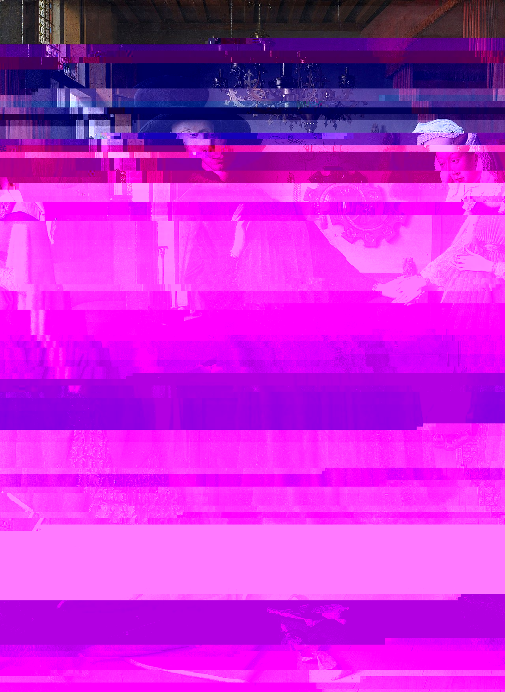
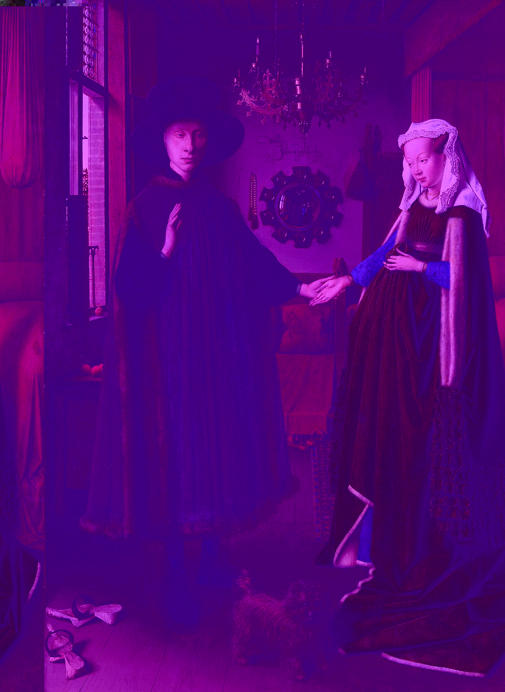
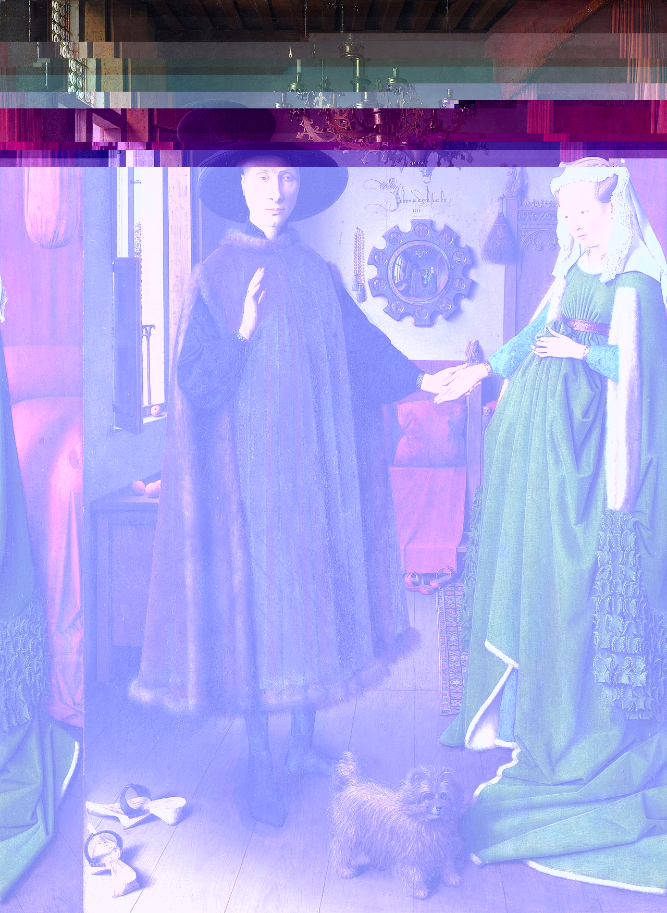
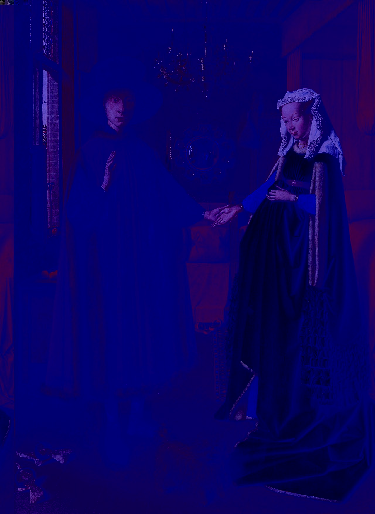
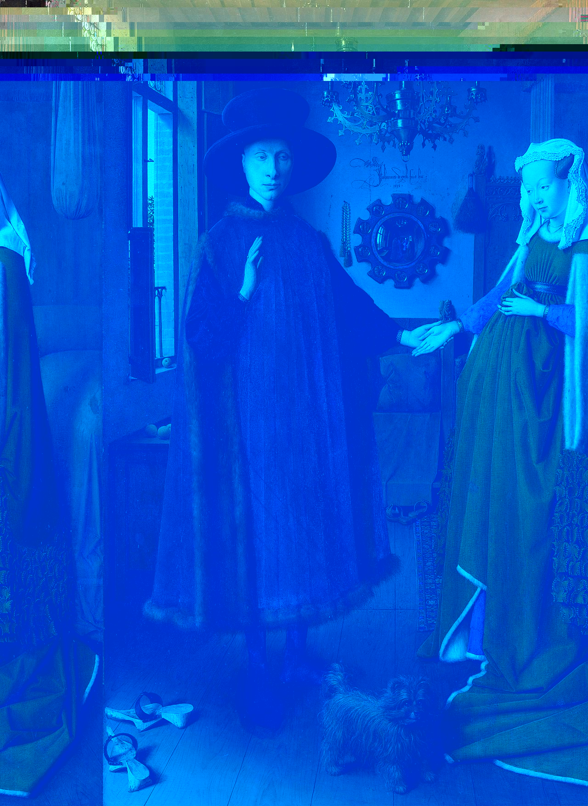
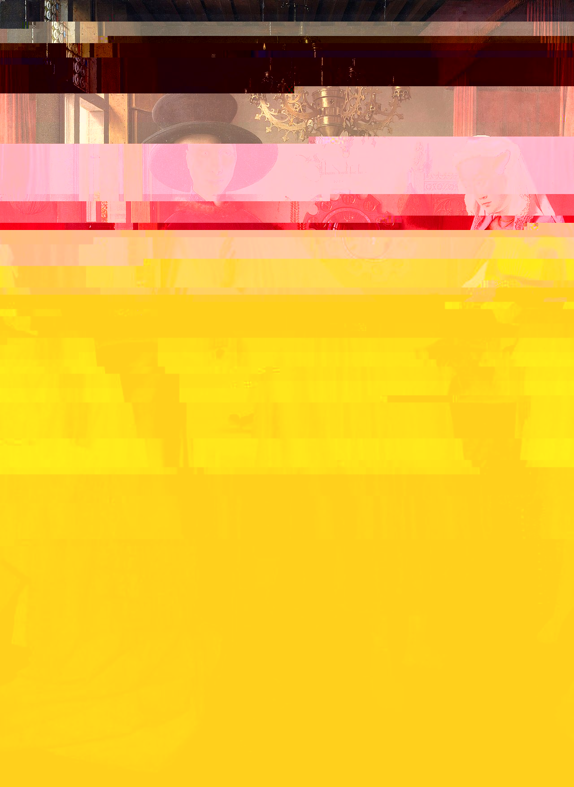

# glitch

Image in, corrupted image out.

## Realistic glitches

Glitches that result from corrupted file data.

### JPEG

* JPEG wikipedia https://en.wikipedia.org/wiki/JPEG
* JPEG spec https://www.w3.org/Graphics/JPEG/itu-t81.pdf
* JFIF spec https://www.w3.org/Graphics/JPEG/jfif3.pdf

#### Corrupted entropy data

- find `FFDA` (start of scan) marker in byte stream, two bytes after that are the length, read and skip those
- until next marker (`FFxx`, but not `FF00`)
  - skip N bytes, where N random from reasonable range (pay attention to [byte stuffing (0xFF00)](https://en.wikipedia.org/wiki/Consistent_Overhead_Byte_Stuffing)
  - overwrite 1 byte with
    - slightly different value (e.g. AB->A7)
    - random byte (probably nicer/heaver glitch but gets corrupted more easily)
- find next start of scan marker and repeat

##### Portrait of Giovanni Arnolfini and his Wife

#### Corrupted header data

No idea if feasible or desirable.

## Artistic glitches

Format-independent artistic interpretations of corrupted data.

- fractal pixelation spots?
- whatever Pony Island does?
